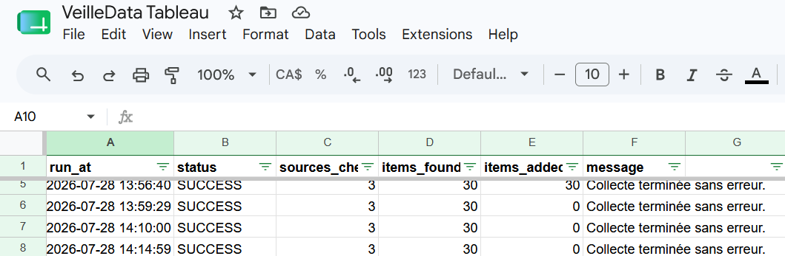
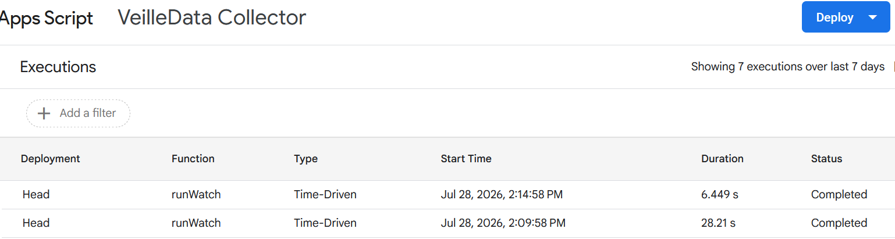

# Veille technologique automatisée avec Google Sheets, Apps Script et Tableau Public


Ce dépôt présente un **démonstrateur pédagogique de veille technologique automatisée**.

Il montre comment :

1. suivre plusieurs sources techniques publiques 
2. récupérer automatiquement leurs nouvelles publications 
3. stocker les résultats dans Google Sheets 
4. éviter les doublons 
5. conserver une étape de revue humaine 
6. visualiser la veille dans Tableau Public 
7. documenter les choix techniques, les risques et les limites.

Le projet repose sur quatre éléments complémentaires :

```text
Flux GitHub Releases
        ↓
Google Apps Script
        ↓
Google Sheets
        ↓
Tableau Public
```

Le dépôt GitHub contient le **code, la documentation et les captures d’écran**.  
Le Google Sheet vivant reste dans le Google Drive de la personne qui installe le projet.

[Voir le dashboard Tableau Public](https://public.tableau.com/views/Veilletechnologiqueautomatise/Tableaudebord1?:language=fr-FR&publish=yes&:sid=&:redirect=auth&:display_count=n&:origin=viz_share_link)

---

## Sommaire

- [1. À quoi sert ce démonstrateur ?](#1-à-quoi-sert-ce-démonstrateur-)
- [2. Pourquoi cette architecture ?](#2-pourquoi-cette-architecture-)
- [3. Ce qui est automatisé et ce qui reste humain](#3-ce-qui-est-automatisé-et-ce-qui-reste-humain)
- [4. Architecture détaillée](#4-architecture-détaillée)
- [5. Structure du dépôt](#5-structure-du-dépôt)
- [6. Prérequis](#6-prérequis)
- [7. Créer le Google Sheet](#7-créer-le-google-sheet)
- [8. Installer le script Apps Script](#8-installer-le-script-apps-script)
- [9. Autoriser et tester le script](#9-autoriser-et-tester-le-script)
- [10. Configurer le déclencheur quotidien](#10-configurer-le-déclencheur-quotidien)
- [11. Ajouter la revue humaine](#11-ajouter-la-revue-humaine)
- [12. Connecter Google Sheets à Tableau](#12-connecter-google-sheets-à-tableau)
- [13. Construire le dashboard](#13-construire-le-dashboard)
- [14. Publier sur Tableau Public](#14-publier-sur-tableau-public)
- [15. Mesures de cybersécurité](#15-mesures-de-cybersécurité)
- [16. Vérifier que l’automatisation fonctionne](#16-vérifier-que-lautomatisation-fonctionne)
- [17. Ne pas plagier ce projet](#17-ne-pas-plagier-ce-projet)
- [18. Idées de veilles différentes](#18-idées-de-veilles-différentes)
- [19. Limites du démonstrateur](#19-limites-du-démonstrateur)
- [20. Dépannage](#20-dépannage)
- [21. Documentation complémentaire](#21-documentation-complémentaire)
- [22. Licence](#22-licence)

---

# 1. À quoi sert ce démonstrateur ?

Une veille technologique consiste à suivre régulièrement des sources afin de repérer :

- de nouvelles versions d’outils 
- des changements importants 
- des fonctionnalités à tester 
- des risques de compatibilité 
- des tendances utiles à un projet 
- des informations qui peuvent modifier une décision technique.

Dans ce démonstrateur, trois flux GitHub Releases sont suivis :

- **Pandera**, pour la validation de données 
- **Great Expectations**, pour la qualité des données 
- **scikit-learn**, pour le machine learning et la détection d’anomalies.

À chaque exécution, le script :

1. lit la liste des sources actives 
2. récupère leur flux Atom 
3. extrait les publications récentes 
4. normalise les champs 
5. calcule un identifiant stable 
6. vérifie si la publication existe déjà 
7. ajoute uniquement les nouveaux éléments 
8. enregistre le résultat dans un journal d’exécution.

Les publications sont ensuite affichées dans un dashboard Tableau comprenant notamment :

- le nombre de publications collectées 
- le nombre de sources suivies 
- le nombre d’éléments revus 
- la date de dernière collecte 
- une chronologie des publications 
- une répartition par source 
- une répartition par statut de revue 
- les publications les plus récentes.


---

# 2. Pourquoi cette architecture ?

Cette architecture a été choisie pour être :

- **compréhensible**, car chaque outil a une fonction claire 
- **accessible**, car elle ne nécessite pas de serveur personnel 
- **démontrable**, car les résultats sont visibles dans Google Sheets et Tableau 
- **automatisable**, grâce aux déclencheurs Apps Script 
- **réutilisable**, car le code et la documentation peuvent être adaptés à d’autres sujets 
- **honnête**, car elle distingue la collecte automatique du jugement humain.

## Rôle de chaque outil

| Outil | Rôle |
|---|---|
| GitHub Releases | Sources publiques de la veille |
| Google Apps Script | Collecte, nettoyage, validation, déduplication et journalisation |
| Google Sheets | Stockage vivant des données |
| Tableau Desktop | Construction du dashboard |
| Tableau Public | Publication publique de la visualisation |
| GitHub | Conservation du code, de la documentation et des preuves du projet |

## Point essentiel

Le Google Sheet **ne doit pas être déplacé dans GitHub**.

Il reste dans Google Drive, car :

- Apps Script est rattaché au classeur 
- le déclencheur quotidien met ce classeur à jour 
- Tableau utilise ce classeur comme source de données 
- GitHub ne remplace pas une base de données opérationnelle.

GitHub contient une copie du code et la documentation nécessaire pour reproduire l’installation.

---

# 3. Ce qui est automatisé et ce qui reste humain

Une veille professionnelle ne consiste pas uniquement à collecter des liens.

Le système automatise les tâches répétitives, mais il ne prétend pas remplacer l’interprétation.

## Tâches automatisées

- lecture des flux 
- récupération des publications 
- validation des URLs 
- parsing du XML Atom 
- nettoyage des textes 
- création des identifiants 
- déduplication 
- ajout dans Google Sheets 
- journalisation 
- exécution quotidienne 
- alimentation du dashboard.

## Tâches humaines

- décider si une publication mérite d’être lue 
- évaluer sa pertinence 
- décider si elle doit être testée 
- expliquer son impact potentiel sur un projet 
- vérifier que la publication a été relue 
- formuler une conclusion professionnelle.

Les champs humains sont :

```text
status
relevance
project_impact
reviewed
```

Cette séparation est volontaire. Une publication peut être collectée automatiquement sans être importante. Une personne doit encore comprendre son contenu et décider quoi en faire.

---

# 4. Architecture détaillée

```text
┌─────────────────────────────────────────────┐
│ Sources publiques                           │
│                                             │
│ Pandera Releases                            │
│ Great Expectations Releases                 │
│ scikit-learn Releases                       │
└──────────────────────┬──────────────────────┘
                       │ HTTPS / Atom
                       ▼
┌─────────────────────────────────────────────┐
│ Google Apps Script                          │
│                                             │
│ • liste blanche des URLs                    │
│ • contrôle du format                        │
│ • nettoyage                                 │
│ • protection contre les formules            │
│ • identifiants SHA-256                      │
│ • déduplication                             │
│ • verrou d’exécution                        │
│ • journalisation                            │
└──────────────────────┬──────────────────────┘
                       │ écriture
                       ▼
┌─────────────────────────────────────────────┐
│ Google Sheets                               │
│                                             │
│ sources                                     │
│ items                                       │
│ run_log                                     │
└──────────────────────┬──────────────────────┘
                       │ connexion
                       ▼
┌─────────────────────────────────────────────┐
│ Tableau Desktop / Tableau Public            │
│                                             │
│ KPI, graphiques, filtres, tableau récent    │
└─────────────────────────────────────────────┘
```

---

# 5. Structure du dépôt

```text
.
├── README.md
├── LICENSE
├── apps-script/
│   ├── Code.gs
│   └── appsscript.json
├── docs/
│   ├── DATA_DICTIONARY.md
│   └── SECURITY.md
├── screenshots/
│   ├── tableau-dashboard.png
│   ├── run-log.png
│   └── daily-trigger.png
└── samples/
    └── sample_items.csv
```

## Contenu des principaux fichiers

| Fichier | Rôle |
|---|---|
| `README.md` | Guide complet d’installation et d’adaptation |
| `apps-script/Code.gs` | Code principal du collecteur |
| `apps-script/appsscript.json` | Manifeste Apps Script et permissions |
| `docs/DATA_DICTIONARY.md` | Description des onglets, champs et règles |
| `docs/SECURITY.md` | Mesures de cybersécurité et limites |
| `screenshots/` | Preuves visuelles du fonctionnement |
| `samples/sample_items.csv` | Exemple de structure, sans données confidentielles |

---

# 6. Prérequis

Pour reproduire ce démonstrateur, il faut :

- un compte Google 
- Google Sheets 
- Google Apps Script 
- Tableau Desktop ou Tableau Public Edition 
- un compte Tableau Public 
- un compte GitHub pour documenter le projet.

Aucune clé API n’est nécessaire.

## Recommandation de confidentialité

Tableau peut demander un accès large au Google Drive associé au compte utilisé.

Pour éviter d’exposer un Drive personnel contenant des documents confidentiels, il est préférable d’utiliser :

- un compte Google dédié au projet ;
- ou un Drive ne contenant que les fichiers nécessaires à la démonstration.

---

# 7. Créer le Google Sheet

Créer un nouveau classeur Google Sheets, par exemple :

```text
VeilleData Tableau
```

Ajouter exactement trois onglets :

```text
sources
items
run_log
```

Les noms doivent rester identiques, car le script les utilise.

---

## 7.1 Onglet `sources`

Créer les colonnes suivantes dans la première ligne :

```text
source_id	source_name	feed_url	source_type	theme_hint	active
```

Ajouter les trois sources de démonstration :

| source_id | source_name | feed_url | source_type | theme_hint | active |
|---|---|---|---|---|---|
| `pandera` | `Pandera Releases` | `https://github.com/unionai-oss/pandera/releases.atom` | `GitHub Release` | `Data Quality` | `TRUE` |
| `great_expectations` | `Great Expectations Releases` | `https://github.com/fivetran/great_expectations/releases.atom` | `GitHub Release` | `Data Quality` | `TRUE` |
| `scikit_learn` | `scikit-learn Releases` | `https://github.com/scikit-learn/scikit-learn/releases.atom` | `GitHub Release` | `Anomaly Detection` | `TRUE` |

### Signification des champs

| Champ | Utilité |
|---|---|
| `source_id` | Identifiant technique stable |
| `source_name` | Nom visible dans le dashboard |
| `feed_url` | Adresse du flux Atom |
| `source_type` | Type de source |
| `theme_hint` | Thème attribué aux publications |
| `active` | Active ou désactive la collecte |

Transformer la colonne `active` en cases à cocher.

---

## 7.2 Onglet `items`

Créer les colonnes suivantes :

```text
item_id	fetched_at	published_at	source_name	source_type	title	url	summary	theme	status	relevance	project_impact	reviewed
```

Les neuf premières colonnes sont automatiques :

```text
item_id
fetched_at
published_at
source_name
source_type
title
url
summary
theme
```

Les quatre dernières sont manuelles :

```text
status
relevance
project_impact
reviewed
```

### Pourquoi cette séparation ?

Le script doit pouvoir ajouter de nouvelles publications sans effacer le travail d’analyse déjà réalisé.

Les colonnes automatiques peuvent donc être protégées dans Google Sheets, tandis que les colonnes humaines restent modifiables.

---

## 7.3 Onglet `run_log`

Créer les colonnes suivantes :

```text
run_at	status	sources_checked	items_found	items_added	message
```

Cet onglet sert à vérifier que l’automatisation fonctionne.

Exemple :

| run_at | status | sources_checked | items_found | items_added | message |
|---|---|---:|---:|---:|---|
| `2026-07-28 13:56:41` | `SUCCESS` | 3 | 30 | 30 | Collecte terminée |
| `2026-07-28 13:59:29` | `SUCCESS` | 3 | 30 | 0 | Aucun nouvel élément |

La deuxième ligne prouve que la déduplication fonctionne.



---

# 8. Installer le script Apps Script

Depuis le Google Sheet :

1. ouvrir **Extensions** 
2. choisir **Apps Script** 
3. renommer le projet, par exemple `VeilleData Collector` 
4. ouvrir le fichier `Code.gs` 
5. remplacer son contenu par celui de [`apps-script/Code.gs`](apps-script/Code.gs) 
6. ouvrir les paramètres du projet 
7. activer l’affichage du fichier manifeste 
8. ouvrir `appsscript.json` 
9. remplacer son contenu par celui de [`apps-script/appsscript.json`](apps-script/appsscript.json) 
10. enregistrer le projet.

## Pourquoi copier aussi `appsscript.json` ?

Le manifeste permet de déclarer explicitement :

- les permissions OAuth 
- les domaines externes autorisés 
- les paramètres techniques du projet.

Cela évite de laisser Apps Script demander des permissions plus larges que nécessaire.

## Vérification importante

Le début de `Code.gs` doit contenir :

```javascript
/**
 * @OnlyCurrentDoc
 */
```

Cette annotation indique que le script doit limiter son accès au classeur courant.

---

# 9. Autoriser et tester le script

Dans Apps Script :

1. sélectionner la fonction `runWatch` 
2. cliquer sur **Exécuter** 
3. accepter les autorisations demandées 
4. revenir au Google Sheet 
5. ouvrir l’onglet `items` 
6. vérifier que des lignes ont été ajoutées 
7. ouvrir `run_log` 
8. vérifier qu’une ligne `SUCCESS` est présente.

Lors de la première exécution, le résultat attendu est proche de :

```text
SUCCESS | 3 sources | 30 éléments trouvés | 30 éléments ajoutés
```

Relancer immédiatement `runWatch`.

Le résultat attendu est alors :

```text
SUCCESS | 3 sources | 30 éléments trouvés | 0 élément ajouté
```

Cette deuxième exécution est importante. Elle démontre que le script ne duplique pas les éléments déjà collectés.

---

# 10. Configurer le déclencheur quotidien

Une exécution manuelle ne constitue pas encore une automatisation.

Il faut créer un déclencheur temporel.

Dans Apps Script :

1. cliquer sur l’icône **Déclencheurs** dans la barre latérale 
2. cliquer sur **Ajouter un déclencheur** 
3. sélectionner la fonction `runWatch` 
4. choisir la version `Head` 
5. choisir comme source de l’événement **Basé sur le temps** 
6. choisir **Minuteur journalier** 
7. sélectionner une plage horaire, par exemple `08:00 à 09:00` 
8. enregistrer.

Google choisit l’heure exacte à l’intérieur de la plage indiquée. Le script ne s’exécute donc pas nécessairement à la minute précise.



## Test conseillé

Avant de créer le déclencheur quotidien définitif, il est possible de créer temporairement un déclencheur toutes les cinq minutes.

Après avoir confirmé qu’une nouvelle ligne apparaît automatiquement dans `run_log` :

1. supprimer le déclencheur de test 
2. créer le déclencheur journalier définitif.

Ne pas conserver inutilement un déclencheur fréquent, car il consommerait davantage de quotas Apps Script.

---

# 11. Ajouter la revue humaine

Dans l’onglet `items`, ajouter des listes déroulantes.

## Colonne `status`

Valeurs proposées :

```text
À lire
À tester
Retenu
Écarté
```

## Colonne `relevance`

Valeurs proposées :

```text
Faible
Moyenne
Forte
```

## Colonne `reviewed`

Transformer la colonne en cases à cocher.

## Colonne `project_impact`

Cette colonne reste en texte libre.

Elle doit expliquer la conséquence possible de la publication, par exemple :

```text
Tester la nouvelle règle de validation sur le POC actuel.
```

ou :

```text
Aucun impact immédiat, mais évolution à surveiller.
```

## Pourquoi ne pas automatiser ces champs ?

Un titre de release ne suffit pas pour conclure qu’une mise à jour est utile.

L’analyse doit tenir compte :

- du projet concerné 
- du niveau de maturité de la fonctionnalité 
- de la compatibilité 
- du coût de migration 
- des risques 
- du bénéfice réel.

Le système collecte. La personne interprète.

---

# 12. Connecter Google Sheets à Tableau

## 12.1 Préparer la connexion

Vérifier que :

- le Google Sheet contient les données attendues 
- les colonnes automatiques sont correctement typées 
- aucun secret ou document privé ne sera exposé 
- le compte Google utilisé pour Tableau est approprié.

## 12.2 Dans Tableau Desktop

1. ouvrir Tableau 
2. choisir **Se connecter à des données** 
3. sélectionner **Google Drive** 
4. se connecter avec le compte Google prévu 
5. sélectionner le classeur `VeilleData Tableau` 
6. utiliser principalement l’onglet `items` 
7. vérifier les types de données.

Types recommandés :

| Champ | Type Tableau |
|---|---|
| `item_id` | Chaîne |
| `fetched_at` | Date et heure |
| `published_at` | Date et heure |
| `source_name` | Chaîne |
| `title` | Chaîne |
| `url` | Chaîne |
| `status` | Chaîne |
| `relevance` | Chaîne |
| `reviewed` | Booléen |

Les onglets `sources` et `run_log` ne sont pas nécessaires dans le dashboard principal.

---

# 13. Construire le dashboard

Le dashboard de démonstration comprend :

## KPI

- nombre total de publications 
- nombre distinct de sources 
- nombre d’éléments revus 
- dernière collecte.

## Visualisations

- publications par mois et par source 
- publications par source 
- répartition par statut de revue 
- cinq publications les plus récentes.

## Champs calculés utiles

### Statut affiché

```tableau
IF ISNULL([status]) OR TRIM([status]) = "" THEN
    "Non classé"
ELSE
    [status]
END
```

### Pertinence affichée

```tableau
IF ISNULL([relevance]) OR TRIM([relevance]) = "" THEN
    "Non évaluée"
ELSE
    [relevance]
END
```

### Revue affichée

```tableau
IF [reviewed] THEN
    "Revu"
ELSE
    "Non revu"
END
```

### Nombre revu

```tableau
IF [reviewed] THEN
    1
ELSE
    0
END
```

### Source courte

```tableau
CASE [source_name]
WHEN "Great Expectations Releases" THEN "Great Expectations"
WHEN "Pandera Releases" THEN "Pandera"
WHEN "scikit-learn Releases" THEN "scikit-learn"
ELSE [source_name]
END
```

### Dernière collecte

```tableau
MAX([fetched_at])
```

## Interactivité

Les graphiques peuvent être utilisés comme filtres du dashboard.

Par exemple, cliquer sur `Pandera` peut filtrer :

- la chronologie 
- les statuts 
- les publications récentes.

Une action URL peut également ouvrir la release d’origine stockée dans le champ `url`. Cette action ouvre la publication source sur GitHub. Elle n’ouvre pas le dépôt de ce démonstrateur.

---

# 14. Publier sur Tableau Public

Dans Tableau Desktop :

1. ouvrir le menu **Serveur** 
2. choisir **Tableau Public** 
3. sélectionner **Enregistrer sur Tableau Public** 
4. se connecter 
5. donner un nom au classeur 
6. publier 
7. ouvrir le dashboard dans le navigateur 
8. vérifier la mise en page et les filtres 
9. conserver l’URL publique.

Exemple de titre :

```text
Veille technologique automatisée
```

## Avertissement

Tableau Public est public.

Le classeur publié et les données de l’extrait peuvent être accessibles à d’autres personnes.

Ne jamais publier :

- de données personnelles 
- d’adresses électroniques privées 
- de clés API 
- de tokens 
- de documents confidentiels 
- de données clients 
- de données RH 
- de secrets industriels.

Ce démonstrateur utilise uniquement des informations publiques issues de GitHub Releases.

[Voir le dashboard Tableau Public](https://public.tableau.com/views/Veilletechnologiqueautomatise/Tableaudebord1?:language=fr-FR&publish=yes&:sid=&:redirect=auth&:display_count=n&:origin=viz_share_link)

---

# 15. Mesures de cybersécurité

La sécurité ne consiste pas seulement à ajouter un mot de passe. Elle commence par limiter ce que le système peut faire et ce qu’il accepte.

## 15.1 Accès limité au classeur courant

Le script utilise :

```javascript
@OnlyCurrentDoc
```

### Pourquoi ?

Sans limitation, un script pourrait demander un accès plus large au compte Google. Ici, il n’a besoin que du classeur auquel il est rattaché.

---

## 15.2 Permissions OAuth explicites

Les scopes sont déclarés dans `appsscript.json`.

### Pourquoi ?

Le principe du moindre privilège consiste à accorder uniquement les permissions nécessaires.

---

## 15.3 Liste blanche des URLs

Le script accepte uniquement les flux prévus.

### Pourquoi ?

Une URL modifiée dans le Sheet ne doit pas permettre au script d’appeler n’importe quel domaine.

---

## 15.4 HTTPS obligatoire

Les flux doivent utiliser HTTPS.

### Pourquoi ?

HTTPS protège la transmission contre l’interception et la modification en transit.

---

## 15.5 Redirections désactivées

Le script n’accepte pas automatiquement une redirection vers une autre adresse.

### Pourquoi ?

Une source autorisée ne doit pas pouvoir envoyer silencieusement le script vers un domaine inattendu.

---

## 15.6 Validation du flux Atom

Le script vérifie que la réponse reçue correspond bien à un flux XML exploitable.

### Pourquoi ?

Une page HTML, une erreur serveur ou un contenu vide ne doit pas être traité comme une publication valide.

---

## 15.7 Limites de taille

Le nombre de sources, le nombre d’éléments et la taille des réponses sont limités.

### Pourquoi ?

Ces limites protègent :

- la mémoire 
- les quotas Apps Script 
- la stabilité du Sheet 
- le temps d’exécution.

---

## 15.8 Protection contre l’injection de formules

Les contenus commençant par certains caractères sont neutralisés avant écriture.

Exemples de caractères à surveiller :

```text
=
+
-
@
```

### Pourquoi ?

Google Sheets pourrait interpréter un titre externe comme une formule au lieu de le traiter comme du texte.

---

## 15.9 Identifiants SHA-256 et déduplication

Chaque élément reçoit un identifiant stable.

### Pourquoi ?

Le script doit reconnaître une publication déjà enregistrée et éviter de l’ajouter plusieurs fois.

---

## 15.10 Verrou d’exécution

Le script utilise un verrou Apps Script.

### Pourquoi ?

Un lancement manuel et un déclencheur automatique pourraient démarrer au même moment. Le verrou évite les écritures concurrentes et les doublons.

---

## 15.11 Écriture par lot

Les nouvelles lignes sont ajoutées en groupe.

### Pourquoi ?

Cette méthode réduit :

- les appels au service Google Sheets 
- le risque d’écriture partielle 
- les problèmes de performance.

---

## 15.12 Gestion des erreurs par source

Une source défaillante ne bloque pas nécessairement toutes les autres.

### Pourquoi ?

La veille doit rester partiellement fonctionnelle et signaler clairement l’origine du problème.

---

## 15.13 Journalisation

Chaque exécution est enregistrée dans `run_log`.

### Pourquoi ?

Sans journal, il serait difficile de savoir :

- si le déclencheur a fonctionné 
- si une source a échoué 
- si des doublons ont été ajoutés 
- quand la dernière collecte a eu lieu.

Pour plus de détails, consulter [`docs/SECURITY.md`](docs/SECURITY.md).

---

# 16. Vérifier que l’automatisation fonctionne

Une démonstration réussie doit fournir des preuves.

## Preuve 1 : première collecte

```text
SUCCESS | 3 | 30 | 30
```

Cela montre que trente éléments ont été détectés et ajoutés.

## Preuve 2 : déduplication

```text
SUCCESS | 3 | 30 | 0
```

Cela montre que les mêmes éléments ont été retrouvés, mais pas dupliqués.

## Preuve 3 : déclencheur automatique

Une nouvelle ligne doit apparaître dans `run_log` sans lancement manuel.

## Preuve 4 : préservation de la revue humaine

Après une nouvelle exécution, vérifier que les valeurs de :

```text
status
relevance
project_impact
reviewed
```

sont toujours présentes.

## Preuve 5 : dashboard public

Vérifier que :

- le dashboard s’ouvre 
- les KPI sont cohérents 
- les filtres fonctionnent 
- les cinq publications récentes sont visibles 
- aucune information privée n’est affichée.

---

# 17. Ne pas plagier ce projet

Ce dépôt est un **modèle pédagogique**, pas un projet à recopier et à présenter comme un travail personnel.

La licence MIT autorise la réutilisation du code sous certaines conditions. Elle ne supprime pas les règles d’intégrité académique ou professionnelle.

## Ce qu’un apprenant peut faire

- étudier l’architecture 
- comprendre les choix 
- réutiliser certaines fonctions 
- adapter le script 
- choisir d’autres sources 
- modifier le modèle de données 
- créer ses propres indicateurs 
- construire un autre dashboard 
- documenter ses décisions 
- citer ce dépôt parmi ses ressources.

## Ce qu’un apprenant ne doit pas faire

- recopier le dépôt sans le comprendre 
- conserver exactement les mêmes sources et les mêmes visuels sans justification 
- présenter le code comme entièrement original 
- masquer l’utilisation d’un modèle existant 
- modifier uniquement les couleurs et considérer le projet comme personnel 
- reprendre les conclusions sans mener sa propre analyse.

## Comment personnaliser réellement le projet

Avant de commencer, répondre à ces questions :

1. Quel est le sujet de ma veille ?
2. Pour quelle personne ou organisation cette veille est-elle utile ?
3. Quelles décisions doit-elle soutenir ?
4. Quelles sources sont suffisamment fiables ?
5. À quelle fréquence faut-il les consulter ?
6. Quels champs doivent être automatisés ?
7. Quels champs nécessitent une interprétation humaine ?
8. Quels risques de sécurité ou de confidentialité existent ?
9. Quels indicateurs racontent réellement quelque chose ?
10. Comment vais-je prouver que l’automatisation fonctionne ?

Un bon projet n’est pas seulement différent en apparence. Il est différent par son objectif, ses sources, ses règles, ses choix et son analyse.

---

# 18. Idées de veilles différentes

Le même principe peut être adapté à de nombreux sujets.

## Data et intelligence artificielle

- nouvelles versions de bibliothèques Python 
- outils de qualité des données 
- modèles open source 
- observabilité des systèmes de machine learning 
- IA responsable et gouvernance 
- bases vectorielles 
- outils de visualisation 
- MLOps.

## Cybersécurité

- bulletins de vulnérabilités 
- mises à jour de sécurité 
- publications de la CISA 
- avis des éditeurs 
- nouvelles CVE concernant une pile logicielle précise.

## Accessibilité numérique

- évolutions des WCAG 
- outils de test 
- mises à jour des navigateurs 
- publications de référence 
- jurisprudence ou réglementation.

## Développement web

- versions de frameworks 
- changements de compatibilité 
- dépréciations 
- outils de test 
- nouvelles fonctionnalités des navigateurs.

## Environnement

- données publiques sur les incendies 
- qualité de l’air 
- sécheresse 
- biodiversité 
- énergie 
- publications scientifiques ciblées.

## Secteur professionnel

- réglementation d’un métier 
- appels à projets 
- nouveaux outils 
- tendances de recrutement 
- publications d’organismes de référence 
- évolutions de normes.

## Règle de choix

Choisir un sujet :

- suffisamment précis pour rester gérable 
- suffisamment utile pour soutenir une décision 
- alimenté par des sources accessibles 
- compatible avec le temps disponible 
- sans données sensibles inutiles.

---

# 19. Limites du démonstrateur

Ce projet reste volontairement simple.

Il ne comprend pas :

- de serveur dédié 
- de base de données relationnelle 
- d’authentification personnalisée 
- de file de messages 
- de surveillance en temps réel 
- de classification automatique par modèle de langage 
- de validation humaine avant insertion 
- de garantie de disponibilité des sources 
- de sauvegarde automatisée avancée.

Les flux GitHub peuvent :

- changer d’adresse 
- modifier leur format 
- devenir indisponibles 
- publier un contenu inattendu.

Tableau Public peut actualiser les données selon son propre calendrier. Le déclencheur Apps Script met à jour Google Sheets, mais cela ne garantit pas une actualisation immédiate du dashboard public.

Ce projet convient à une démonstration sur des données publiques et peu sensibles. Il ne doit pas être utilisé tel quel pour des données médicales, financières, RH ou confidentielles.

---

# 20. Dépannage

## Le script renvoie une erreur de syntaxe

Vérifier que le code ne contient pas de séparateurs numériques non pris en charge, par exemple :

```javascript
1_000_000
```

Utiliser plutôt :

```javascript
1000000
```

---

## `URL is not defined`

Google Apps Script ne prend pas nécessairement en charge l’objet JavaScript `URL` comme dans un navigateur moderne.

La validation doit utiliser les méthodes prévues dans le script, basées sur les chaînes et expressions régulières.

---

## Une source renvoie une redirection

Utiliser directement l’URL canonique du dépôt.

Exemple pour Great Expectations :

```text
https://github.com/fivetran/great_expectations/releases.atom
```

---

## Le script ajoute des doublons

Vérifier :

- que `item_id` est bien calculé 
- que les identifiants existants sont lus avant l’écriture 
- que le verrou est actif 
- que les deux exécutions ne démarrent pas simultanément.

---

## Les colonnes manuelles ont disparu

Le script ne doit pas réécrire l’ensemble de l’onglet `items`.

Il doit uniquement ajouter de nouvelles lignes aux colonnes automatiques, sans remplacer les lignes existantes.

---

## Tableau ne voit pas les nouvelles données

Vérifier successivement :

1. que Google Sheets a bien été mis à jour 
2. que `run_log` contient une exécution récente 
3. que la source Tableau pointe vers le bon classeur 
4. que l’extrait Tableau a été actualisé 
5. que les filtres du dashboard ne masquent pas les nouvelles lignes.

---

## Le dashboard public expose trop d’informations

Retirer les champs inutiles, republier le classeur et vérifier la source de données.

Si un secret a été exposé, le supprimer du dashboard ne suffit pas. Il doit être révoqué et remplacé.

---

# 21. Documentation complémentaire

- [`docs/DATA_DICTIONARY.md`](docs/DATA_DICTIONARY.md) : description complète des champs 
- [`docs/SECURITY.md`](docs/SECURITY.md) : mesures de sécurité et checklist 
- [`apps-script/Code.gs`](apps-script/Code.gs) : collecteur 
- [`apps-script/appsscript.json`](apps-script/appsscript.json) : manifeste et permissions.

---

# 22. Licence

Ce projet est distribué sous licence MIT.

La licence autorise notamment l’utilisation, la modification et la redistribution du code, sous réserve de conserver la notice de licence.

Consulter le fichier [`LICENSE`](LICENSE).

La possibilité légale de réutiliser le code ne dispense pas de :

- citer ses sources 
- expliquer ses adaptations 
- respecter les consignes d’un établissement 
- distinguer le travail personnel du travail repris 
- respecter l’intégrité académique et professionnelle.

---

## Résumé

Ce démonstrateur montre une chaîne complète :

```text
collecter → sécuriser → stocker → relire → visualiser → documenter
```

Sa valeur ne réside pas uniquement dans le dashboard final.

Elle réside aussi dans la capacité à expliquer :

- pourquoi les sources ont été choisies 
- comment l’automatisation fonctionne 
- comment les doublons sont évités 
- pourquoi certaines décisions restent humaines 
- quels risques ont été identifiés 
- quelles protections ont été ajoutées 
- comment le projet pourrait être adapté à un autre besoin.
